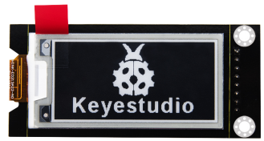
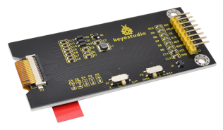
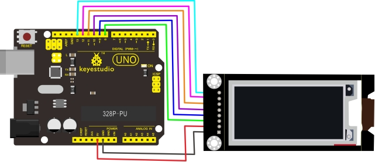
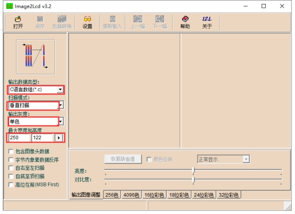
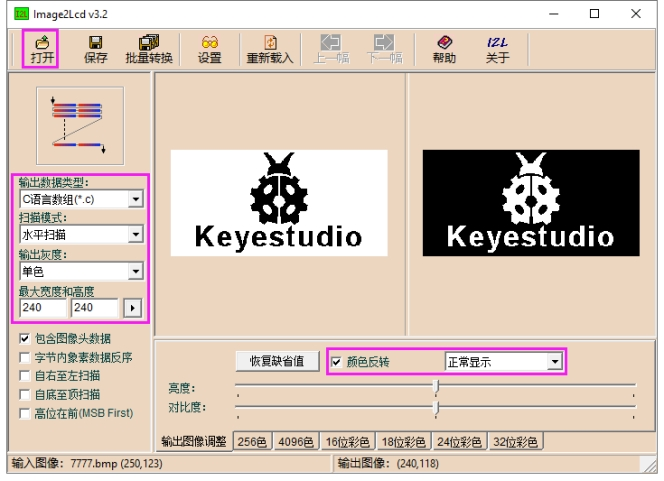
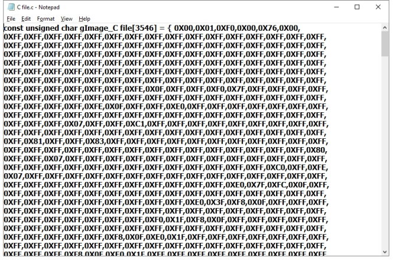
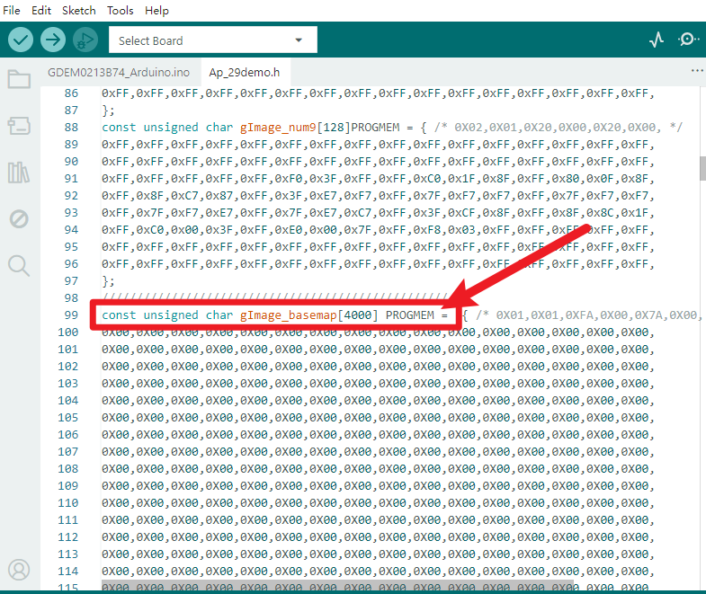
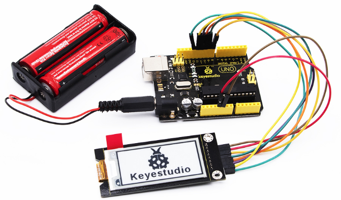

# KS0461 Keyestudio Electronic Ink Screen Module 2.13 Inch

## 1. Description

When doing DIY experiments, we often need to use the display. The Keyestudio electronic ink screen module has a 2.13-inch display with a black and white color and a resolution of 250*122.

The module dynamically displays the pattern via SPI communication.

There are 2 slide switches on the back. The P1 slide switch is for adjusting the display brightness.The DIP switch must be slid to “3” position, because sliding to “0.47”may cause problems.

The P2 DIP switch is used to adjust the power supply voltage. Sliding to“5VIN” position, the power supply voltage is 5V; sliding to “3.3VIN”, the power supply voltage is 3.3V.

The module comes with two positioning holes with a diameter of 3mm, easy to fix it on other devices .

For your convenience, we also provide detailed methods for using the display module and the arduino microcontroller.

Special Note: When testing, we use the IDE software 1.8.9 version; if you use other versions of the IDE, source code may be incompatible.

## 2. Technical parameters

- Operating voltage: DC 3.3 or 5V (slide switch control)
- Working current: 100mA
- Maximum power: 0.8W
- Display color: black and white
- Display size: 2.13 inches
- Display resolution: 250*122
- Interface type: 8pin pin header with 2.54mm pitch
- Operating temperature range: -10℃ to +50℃
- Positioning hole size: diameter 3mm

## 3. Wiring Diagram

## 4. Test code

Download Resource : [Resource](./Resource.7z)

**The resource pack contains code**

## 5. Setting the Code

1. Before settings, we need to install Image2Lcd software. After installation, register with the registration code.
2. Use the drawing software to draw the pattern you need, export set to black and white, and the pixel is set to 250*122.
3. Open the modulo software and set as the following picture shown.

4. Clickto select the pattern you exported, as shown below. Normal display  (black on white), then tick "color reversal"; negative display (white on black ) does not need to tick.

5. Click Save, generate the corresponding C language file. As shown below.

6. Copy and paste the C file code to the position of const unsigned char gImage_basemap[4000] PROGMEM or const unsigned char gImage_1[4000] PROGMEM, shown below.

## 6. Test Result

Done uploading the source code, the E-ink Screen will display patterns. As shown below. ( at this moment, slide switch 1 to “3”, slide switch 2 to “5VIN”)

